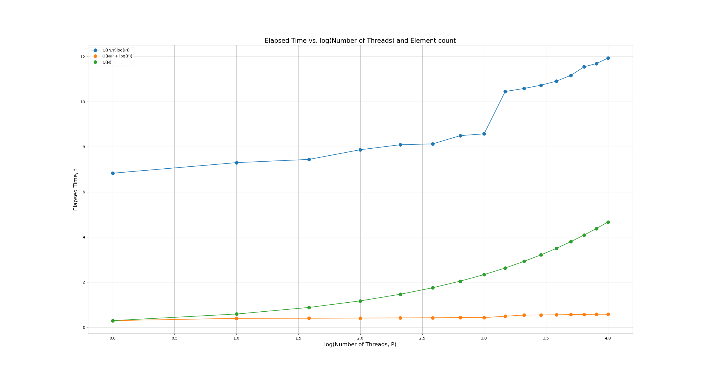
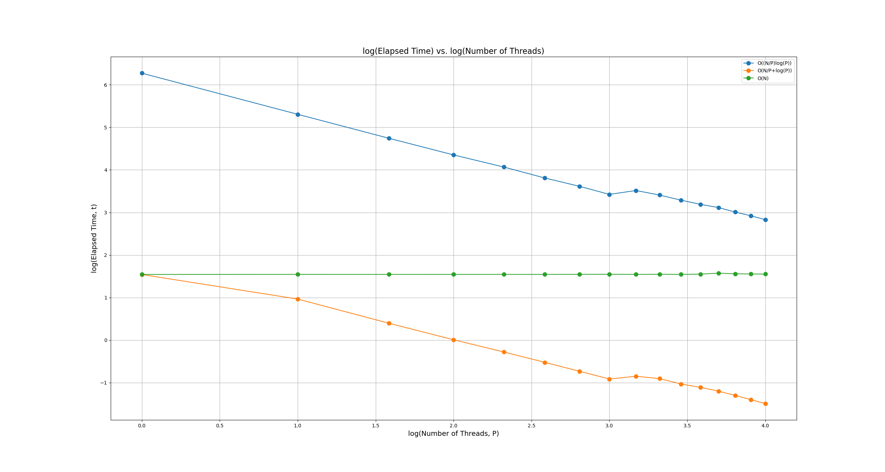

# CSCE 626 -- Homework 1  

## Due Sunday Feb 9th by midnight.

## Objectives
* Implement a O(lg(P) + N/P) version of Prefix Sum in OpenMP
* Using the O(log(N) * N/P) version we implemented in class (see code_examples directory), setup an experimental comparison between the two versions and also the sequential std::partial_sum
* Setup both Weak and Strong scaling experiments to compare the 3 versions of Prefix Sum
  * Strong Scaling:    Set the input size to 100 million and vary the number of threads between 1 - #cores
  * Weak Scaling:   Starting at 10 million with 1 thread, increase both N and P simultaneously (e.g., double them)
* Document your experiments by writing a brief report on your experimental study


## Deliverables and Rubric
* 50pts for a correct O(lg(P) + N/P) implementation of Prefix Sum in OpenMP 
* 25pts for your report on your Weak Scaling study
* 25pts for your report on your Strong Scaling study
* If you're inspired to experiment with other variations, please do so!    These are just the basic requirements for the assignment.

## Submission Instructions
* Fork this repository, it should default to private (double check), and then manually add me (rogerpearce) and our TA(krishnanprash)
* Commit and push your code into this directory of your fork
* Commit and push your report and figures to this file and directory

## Student Report
*  Write your report here and add any images to this directory 

### Weak Scaling Study



```bash
$ python weak_scaling.py 
```

```
'O((N/P)log(P))': [6.82906, 7.29763, 7.44068, 7.87029, 8.09073, 8.1294, 8.49535, 8.57533, 10.452, 10.5865, 10.7336, 10.9132, 11.1698, 11.547, 11.6928, 11.9331]
'O(N/P + log(P))': [0.290359, 0.391647, 0.395398, 0.402196, 0.413053, 0.41877, 0.424863, 0.424247, 0.486661, 0.535042, 0.540312, 0.547167, 0.563857, 0.564479, 0.569853, 0.570947]
'O(N)': [0.291574, 0.582825, 0.874964, 1.16636, 1.45949, 1.74851, 2.0422, 2.33319, 2.62241, 2.91867, 3.20805, 3.49739, 3.79528, 4.08547, 4.37676, 4.66478]
```

Weak scaling measures how the solution time changes when the problem size increases in proportion to the number of processing units. Ideally, the execution time should remain constant if the computation scales perfectly in parallel algorithms.

- **O((N/P)log(P))**: Shows a gradual increase from `6.82906` to `11.9331` as the number of processors increases. Overall it shows an increasing trend even though parallelism exists. This could be due to communication or overhead cost grow with processors. 
- **O(N/P + log(P))**: Remains relatively stable. Small change observed from `0.290359` to `0.570947`. This algorithm demonstrates efficient use of parallelism with minimal overhead.
- **O(N)**: Demonstrates a linear growth from `0.291574` to `4.66478`. This is expected as we are only using one processor for the computation.

### Strong Scaling Study



```bash
$ python strong_scaling.py 
```

```
'O((N/P)log(P))': [77.3024, 39.5559, 26.7812, 20.4142, 16.7621, 14.0247, 12.2463, 10.7334, 11.4346, 10.6185, 9.76413, 9.1247, 8.65946, 8.04699, 7.5776, 7.10456]
'O(N/P+log(P))': [2.91073, 1.9519, 1.3165, 1.006, 0.824669, 0.69646, 0.602444, 0.531029, 0.555319, 0.534198, 0.489496, 0.463203, 0.43516, 0.406367, 0.379374, 0.355883]
'O(N)': [2.91466, 2.91688, 2.91668, 2.91604, 2.91653, 2.91614, 2.91916, 2.92324, 2.91682, 2.92333, 2.91705, 2.93033, 2.97645, 2.94348, 2.93725, 2.93166]
```

Strong scaling measures how the solution time changes when the number of processors increases while keeping the problem size constant, in this case 100 million as N. Ideally, the execution time should decrease proportionally as the number of processors increases in parallel algorithms.

- **O((N/P)log(P))** time factor decreases significantly from `77.3024` to `7.10456` showing strong scaling behavior.
- **O(N/P + log(P))** time factor decreases from `2.91073` to `0.355883` showing strong scaling behavior.
- **O(N)** remains nearly constant, fluctuating slightly around `2.916` which indicates that the algorithm does not benefit from additional processors as it is a sequential algorithm.