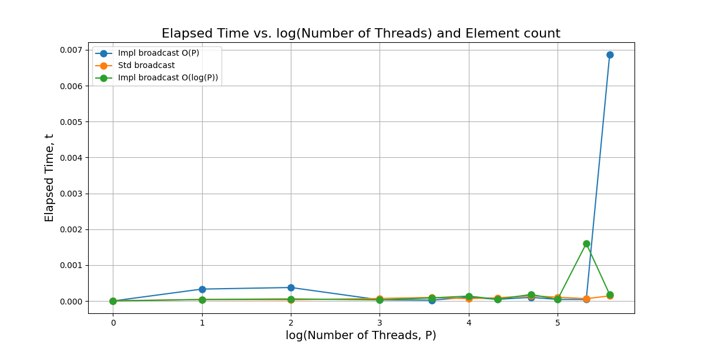
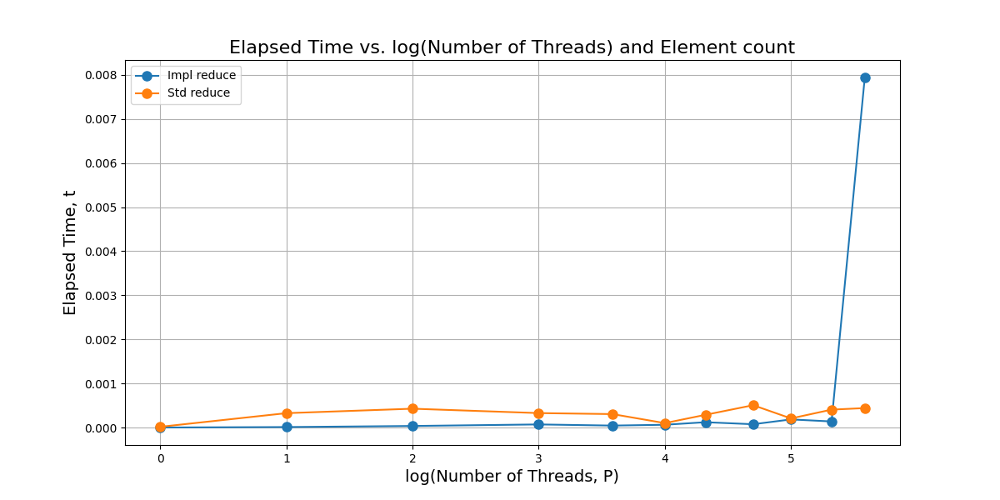
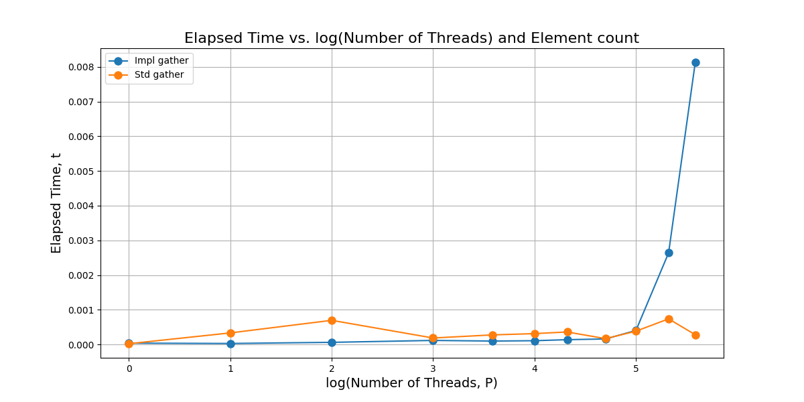
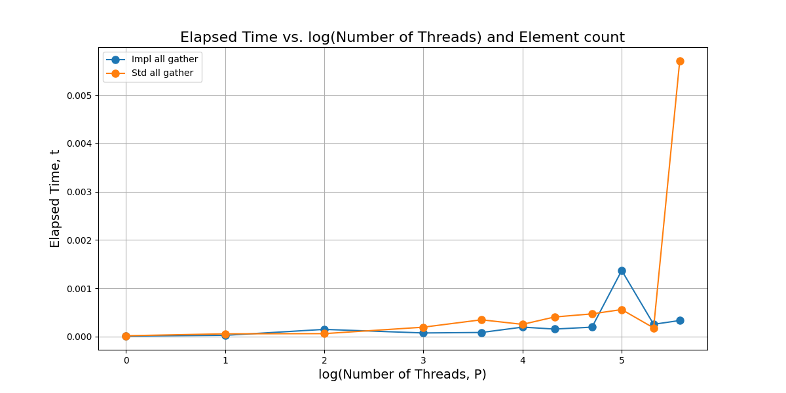

# CSCE 626 -- Homework 2  

## Due Sunday Feb 16th by midnight.

## Objectives (All using MPI)
* Implement an O(P) version of Broadcast
* Implement an O(lg(P)) version of Broadcast
* Implmenet an O(lg(P)) version of Reduce
* Implement an O(lg(P)) version of Gather
* Implmentt an O(P) version of AllGather using a ring algorithm
* Setup weak scaling experiments and compare to MPI built in versions.
* Document your experiments by writing a brief report on your experimental study
* Answer why your performance is (likely) lower than MPI's built in


## Deliverables and Rubric
* 10pts for each correct implmentation (5 in total)
* 10pts for 4 scaling experiments comparing to (MPI_Bcast, MPI_Reduce, MPI_Gather, MPI_Allgather)
* 10pts for discussion of the performance differences between your implmentations and MPI's built in versions.

## Helpful Notes using Grace
* Load GCC and MPI with `module load GCC OpenMPI`
* Launch interactive jobs with:
```
  salloc -n 8 -pshort -t 10:00 --mem-per-cpu=2G
  mpirun <yourexe>
```


## Submission Instructions
* Fork this repository, it should default to private (double check), and then manually add me (rogerpearce) and our TA(krishnanprash)
* Commit and push your code into this directory of your fork
* Commit and push your report and figures to this file and directory

## Student Report

Weak scaling measures how the solution time changes when the problem size increases in proportion to the number of processing units. Ideally, the execution time should remain constant if the computation scales perfectly in parallel algorithms.

The following algorithms have been implemented and tested:
1. **Broadcast**: Implemented in both O(P)-time and O(log(P))-time.
    - For O(log(P))-time implementation:
      ```bash
      mpicxx -o mpi_broadcast_logp mpi_broadcast_logp.cpp
      mpirun mpi_broadcast_logp
      ```
    - For O(P)-time implementation:
      ```bash
      mpicxx -o mpi_broadcast_p mpi_broadcast_p.cpp
      mpirun mpi_broadcast_p
      ```

2. **Reduce**: Implemented in O(log(P))-time.
    ```bash
    mpicxx -o mpi_reduce_logp mpi_reduce_logp.cpp
    mpirun mpi_reduce_logp
    ```

3. **Gather**: Implemented in O(log(P))-time.
    ```bash
    mpicxx -o mpi_gather_p mpi_gather_logp.cpp
    mpirun mpi_gather_logp
    ```

4. **AllGather**: Implemented using a ring algorithm in O(P)-time.
    ```bash
    mpicxx -o mpi_all_gather_p mpi_all_gather_p.cpp
    mpirun mpi_all_gather_p
    ```


Additionally, for the weak scaling study the standard MPI version of the above algorithms were implemented.

# Broadcast Weak Scaling



The above data corresponds to the following processor counts:
Processor counts: [1, 2, 4, 6, 8, 12, 16, 20, 26, 32, 40, 48]

Custom Broadcast O(P): This implementation does not scale as well as the standard MPI or O(log(P))-time algorithm because of its linear nature. With increase in processor counts, there is increase in communication and synchronization overheads compared to other algorithms. Therfore, the performance degradation at higher processor counts can be attributed to this.

Standard MPI Broadcast: The standard MPI broadcast implementation does well with scale, is more consistent, and is better optimized for handling larger systems. It shows negligible increase in execution time as processor counts increase

Custom Broadcast O(log(P)): This implementation provides the most efficient scaling, reflecting the benefits of a logarithmic time complexity. It performs better in larger systems, and thus scales well by reducing communication overheads and by minimizing the growth in execution time.

# Reduce Weak Scaling



The above data corresponds to the following processor counts:
Processor counts: [1, 2, 4, 6, 8, 12, 16, 20, 26, 32, 40, 48]

Initially, the standard built-in function performs worse compared to my custom reduce algorithm until 32 processors. After that, there seems to be some fluctuation - sometimes my algorithm performs better, and sometimes the standard one does. After 40 processors, we can see that the standard built-in MPI_Reduce performs better.

Possible Reasons for This Behavior:
- **Communication Overhead in the Built-in Version**: Our algorithm has predefined parent and child positions, which help speed up the reduction process. In contrast, the standard algorithm dynamically determines nodes and their positions in the reduction tree based on the desired root node. This dynamic root positioning could be the possible reason for this behavior, though it should not directly impact the time complexity.
  
- **Synchronization and Communication Overhead**: Initially, the overhead of synchronization and communication has a lower impact on performance, which is the reason, our algorithm outperforms the built-in version. However, after 40 processors, the standard MPI_Reduce performs better highlighting that its optimizations are effective as it scales.

- **Tree Depth Considerations**: Even with 48 processors, our reduction tree depth is at most 6. To better understand the performance trade-offs, we might need to test with an even higher number of processors.

# Gather Weak Scaling



The above data corresponds to the following processor counts:
Processor counts: [1, 2, 4, 6, 8, 12, 16, 20, 26, 32, 40, 48]

In the weak scaling study, the custom O(log(P))-time gather algorithm shows efficient performance for lower processor counts but experiences a significant increase in execution time beyond 32 processors. This is due to communication and synchronization overheads as the processors increases.

In my gather algorithm, I first send the total number of elements to be sent, then the corresponding array with elements in it. This might create additional overhead and cause communication bottlenecks while scaling. This could be one of the reasons why our algorithm performs poorly after 40 processor counts. Perhaps, MPI standard algorithm might MPI_Isend or MPI_Irecv constructs to improve performance here.

Additionally, as the number of processors increases, although the time complexity remains O(log P) with a log(P)-depth tree, the data transferred to the parent node from the child node doubles at each level. As a result, the top node must collect all n elements in a single operation. There may be better optimizations in the standard MPI_Gather algorithm to prevent the cumulative increase in data transfer at each tree level. This might explain the spike in processing time beyond 40 processors.

In contrast, MPI_Gather performs more consistently across processor counts, with a slower but steady increase in execution time. MPI's built-in optimizations for communication, load balancing, and synchronization allow it to scale better compared to our implementation.

# All Gather Weak Scaling



The above data corresponds to the following processor counts:
Processor counts: [1, 2, 4, 6, 8, 12, 16, 20, 26, 32, 40, 48]

Both the custom all-gather implementation and MPI’s built-in Allgather exhibit a linear increase in execution time, indicating that both likely use the ring algorithm. This algorithm transfers data sequentially between processors, avoiding the higher synchronization overhead seen in tree-based O(logP) approaches, where the data has to be sent in larger chunks as we move towards the root node of the tree.

At lower processor counts, the custom implementation performs similarly or slightly better than MPI’s version. However, at higher counts like about 26 processor counts, the standard  optimizations in standard build in Mpi all gather has better load balancing, message pipelining, and improved optimization that lead to more stable performance. A noticeable performance spike in MPI standard version at 48 processors suggests potential processing congestion or synchronization overhead. Overall, both implementations scale well, but MPI standard version is less varying and better suited for large processor counts.
