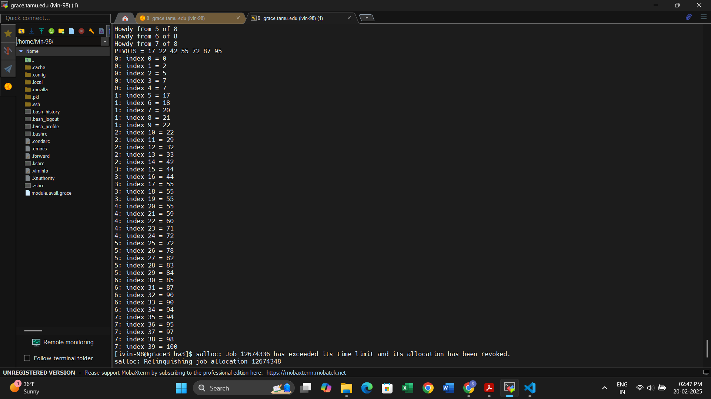

# CSCE 626 -- Homework 3 

## Due Monday Feb 24th by midnight.

## Objectives
* Answer Question 1 below.
* Extend the mpi pivot sort we created during class (see code_examples) to do the following:
    * Add a step to balance the sorted array across each rank (N/P elements per rank)
    * Add the capability to oversample pivots with a parameter 'k' for k pivot samples per rank.
* Setup week and strong scaling experiments up to 128 processors
* Setup experiment with 'k' to oversample from 1 to 100
* Your minimum number of elements for your weak scaling experiments should be 1 Million per rank.


## Deliverables and Rubric
* 20pts for answer to question below
* 20pts for correct sorted array balancing
* 20pts for correct pivot oversampling
* 10pts for Strong scaling experiment and report
* 10pts for Weak scaling experiment and report
* 20pts for k-oversampling experiment and report


## Student Report
*  Question 1:   You are given a large array of N elements on P CREW processors (e.g., OpenMP), where N >> P.    Describe an algorithm in pseudocode based on a parallel merge sort and analyze its complexity on a CREW.   You may use any sequential sort you wish (e.g., Quicksort) for sorting sequential N/P chunks of the array.  You are not required to describe the fastest possible, but are required to anayze the time complexity your pseudcode correctly.


The data is assumed to be evenly distributed across  P processors. Else, one processors can broadcast partitioned data across in O(N)-time to P processors. Here P has to be a power of 2. 

```plaintext
1.  h = P / 2
2.  Each processor sorts its local (N / P) elements using merge sort.  // O((N / P) log (N / P)) time
3.  while (h >= 1) do { // O(log P)
4.      if (rank % (2 * h) >= h) then {
5.          send local sorted data to (rank - h) // O(N/h)
6.      }
7.      else {
8.          receive sorted data from (rank + h) // O(N/h)
9.          merge local sorted data with received sorted data // O(2(N/h))
10.     }
11.     h = h / 2
12. }
```

### Time Complexity Analysis

#### **1. Local Sorting:**  
Each processor sorts N/P elements using merge sort, which takes: O((N/P) log(P)).

#### **2. Merging Steps:**  
At each merging step, each processor merges two sorted arrays of increasing size. The merging work across all processors is:

O(N + N/2 + N/4 + N/8 + ... + N/P) = O(N)

Since there are log(P) merging rounds, the total merging time is: O(N log(P))

#### **3. Overall Complexity:**
Combining both sorting and merging steps:

O((N/P) log(N/P) + N log(P))

This is the total time complexity for parallel merge sort.

* 20pts for correct sorted array balancing
* 20pts for correct pivot oversampling



# Strong Scaling Experiment and Report (10 pts)

Strong scaling measures how the solution time changes when the number of processors increases while keeping the problem size constant, in this case 128 million as N. Ideally, the execution time should decrease proportionally as the number of processors increases in parallel algorithms.

## Strong Scaling Results:


| Processors | Time Elapsed (s) |
|------------|-----------------|
| 1          | 97.6393         |
| 2          | 50.252          |
| 4          | 15.7718         |
| 8          | 14.2543         |
| 16         | 7.06163         |
| 32         | 3.72435         |
| 64         | 2.00855         |
| 128        | 1.10429         |

**N = 128,000,000**  
**k = 100**  

## Observation:
The results align with the expectations for strong scaling. As the number of processors increases, the time elapsed decreases, demonstrating that our algorithm benefits from parallelism. Since the oversampling factor \( k \) and the number of elements (128,000,000) are fixed, they don't directly impact the results. However, there is a small possibility of interference due to uneven data distribution across processes, which could occur if the sampled pivots are not good.


# Weak Scaling Experiment and Report (10 pts)

Weak scaling measures how the solution time changes when the problem size increases in proportion to the number of processing units. Ideally, the execution time should remain constant if the computation scales perfectly in parallel algorithms.

## Weak Scaling Results:


| Processors | Data Size | Time Elapsed (s) |
|------------|----------|-----------------|
| 1          | 1,000,000   | 0.637168   |
| 2          | 2,000,000   | 0.694559   |
| 4          | 4,000,000   | 0.79019    |
| 8          | 8,000,000   | 0.817929   |
| 16         | 16,000,000  | 0.865297   |
| 32         | 32,000,000  | 0.985766   |
| 64         | 64,000,000  | 0.962246   |
| 128        | 128,000,000 | 1.06661    |

**Oversampling factor \( k \) fixed at 100.**

## Observation:
Though the graph appears to increase linearly, the actual interval of increase is very small, with fluctuations, such as at 64 processors. The difference in elapsed time is less than half a second, indicating that the weak scaling results are reasonable. The slight increase in time as the number of processors grows, while keeping the total number of elements the same (128,000,000), could be attributed to noise and communication overhead between processors.

The major reason for this increase is due to fixed oversampling factor \( k = 100 \). As the number of processors doubles, the number of elements also doubles, but since \( k \) remains constant, the oversampling is performed over a much larger dataset. This results in the time increase, as uneven data distribution may impact performance, especially at 128,000,000 elements. The probability of not selecting good pivots increases as we go from (sampling 100 elements and 1,000,000 elements) to (sampling 100 elements from 128,000,000 elements), which could explain this time increase that is observed.

I experimented with doubling the sampling factor \( k \) along with the number of processors and data size, but this did not yield consistent improvements across all cases. This is likely due to the gather time cost of collecting all sampled pivots.  

For instance, at 128 processors and 128,000,000 elements, I tested with \( k = 128,000 \), which should ideally improve pivot selection. However, the elapsed time was 1.71416 seconds, which is slower than the 1.06661 seconds observed with \( k = 100 \). The ideal value for \( k \) seems to be around 700 for 128 processors. Experiments on determining this patterns are shown below.


# k-Oversampling Experiment and Report (20 pts)

## Plots:


# k Pivot Sorting Time Table

| k  | Time (seconds) | k  | Time (seconds) | k  | Time (seconds) | k  | Time (seconds) |
|----|---------------|----|---------------|----|---------------|----|---------------|
| 1  | 3.41647      | 26 | 1.27103      | 51 | 1.14492      | 76 | 1.09757      |
| 2  | 2.52034      | 27 | 1.21733      | 52 | 1.15386      | 77 | 1.08781      |
| 3  | 1.97549      | 28 | 1.17351      | 53 | 1.12689      | 78 | 1.05706      |
| 4  | 1.52258      | 29 | 1.14481      | 54 | 1.13945      | 79 | 1.04355      |
| 5  | 1.57253      | 30 | 1.21135      | 55 | 1.14928      | 80 | 1.12988      |
| 6  | 1.4088       | 31 | 1.14755      | 56 | 1.1355       | 81 | 1.09624      |
| 7  | 1.55706      | 32 | 1.15963      | 57 | 1.10172      | 82 | 1.08049      |
| 8  | 1.57971      | 33 | 1.15298      | 58 | 1.14303      | 83 | 1.1153       |
| 9  | 1.43436      | 34 | 1.10621      | 59 | 1.07184      | 84 | 1.07543      |
| 10 | 1.38525      | 35 | 1.12684      | 60 | 1.08931      | 85 | 1.0975       |
| 11 | 1.33609      | 36 | 1.1          | 61 | 1.09325      | 86 | 1.11564      |
| 12 | 1.32108      | 37 | 1.20097      | 62 | 1.17689      | 87 | 1.11024      |
| 13 | 1.25865      | 38 | 1.12868      | 63 | 1.16996      | 88 | 1.10971      |
| 14 | 1.26771      | 39 | 1.21423      | 64 | 1.11233      | 89 | 1.02944      |
| 15 | 1.27079      | 40 | 1.12553      | 65 | 1.13097      | 90 | 1.06828      |
| 16 | 1.24681      | 41 | 1.1343       | 66 | 1.08343      | 91 | 1.0881       |
| 17 | 1.33984      | 42 | 1.11194      | 67 | 1.09991      | 92 | 1.05221      |
| 18 | 1.21347      | 43 | 1.15114      | 68 | 1.10177      | 93 | 1.05874      |
| 19 | 1.24493      | 44 | 1.17674      | 69 | 1.0901       | 94 | 1.08456      |
| 20 | 1.21579      | 45 | 1.15918      | 70 | 1.11829      | 95 | 1.12202      |
| 21 | 1.23341      | 46 | 1.10312      | 71 | 1.09736      | 96 | 1.048        |
| 22 | 1.23359      | 47 | 1.16087      | 72 | 1.10132      | 97 | 1.02721      |
| 23 | 1.20062      | 48 | 1.12817      | 73 | 1.06874      | 98 | 1.05222      |
| 24 | 1.19749      | 49 | 1.15977      | 74 | 1.08736      | 99 | 1.05309      |
| 25 | 1.17736      | 50 | 1.17176      | 75 | 1.08306      | 100 | 1.05309      |

## Observation:
As the number of pivots sampled increases, the algorithm performs better due to a more balanced partitioning of data among processors. With good pivots, the workload is distributed more uniformly, reducing the probability of some processors receiving disproportionate large partitions.  

This ensures that each processor spends approx \( (N/P) \log(N/P) \) time for sorting, as expected in an ideal parallel sorting algorithm. However with poor pivot choices, some processors might end up with significantly more data to sort, leading to increased sorting time and reducing parallel computation efficiency.