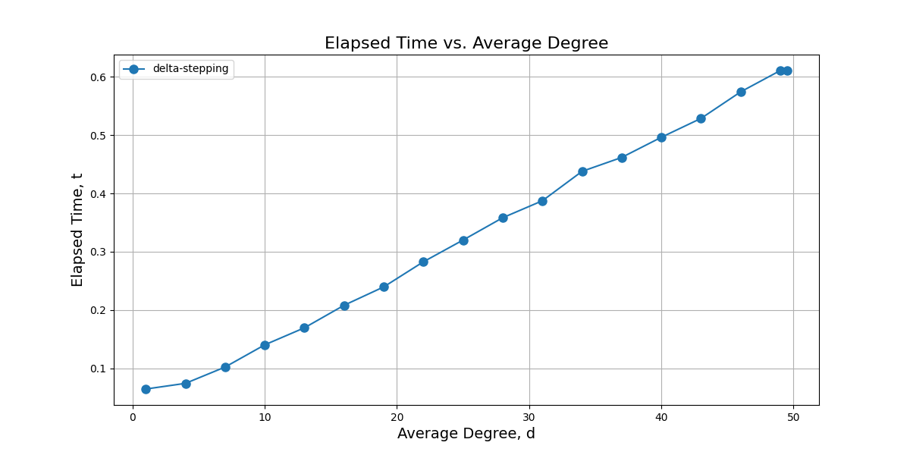

# CSCE 626 -- Homework 4 

## Due Wednesday March 19th by midnight.

## How to build with cmake
``` bash
# from hw4 directory
module load GCC OpenMPI CMake
mkdir build
cd build
cmake ..
#salloc with desired number of processors
salloc -n 8 -pshort -t 50:00 --mem-per-cpu=2G
mpirun bfs_example
```


## Objectives
* Using either raw MPI or YGM, implement Delta Stepping SSSP
* Perform both weak and strong scaling experiments using
  uniformly generated random weighted edges with an average degree of 16
* Design experiments such that you evaluate the sensitivity on 
  the maximum edge weight as well as the average degree of the graph

## Helpful Resources
* https://www.cs.utexas.edu/~pingali/CS395T/2013fa/papers/delta-stepping.pdf
* https://jshun.csail.mit.edu/6886-s19/lectures/lecture23-1.pdf


## Deliverables and Rubric
* 20pts for a correct implementation of Delta Stepping SSSP
* 20pts for weak scaling experiments and discussion
* 20pts for strong scaling experiments and discussion
* 20pts for average degree sensitivity experiments and discussion
* 20pts for maximum edge weight experiments and discussion


## Student Report
*  Append your report here...

# Implementation of Delta Stepping SSSP

The following figure shows the algorithm's results for different values of delta. I used delta = 1 and delta > maximum edge weight in this case. In the former case, the algorithm performs like Dijkstra's algorithm, and in the latter case, it behaves like Bellman-Ford. As expected, the results are the same. This is highlighted in the figure below.


To test the algorithm, please run the following command:

```bash
mpirun -np $(processor_count) delta_step_sssp $(number_of_vertices) $(number_of_edges) $(maximum_edge_weight) $(delta_value)
```

# Weak Scaling Experiments and discussion

| # Processors | # Vertices | # Edges  | Max Edge Weight | Delta (200) | Average Degree  | Time (Measured) |
|--------------|------------|----------|-----------------|-------------|-----------------|-----------------|
| 1            | 31         | 248      | 1,000           | 200         | 16              | 0.00559459      |
| 2            | 62         | 496      | 1,000           | 200         | 16              | 0.0238602       |
| 4            | 125        | 1,000    | 1,000           | 200         | 16              | 0.0678698       |
| 8            | 250        | 2,000    | 1,000           | 200         | 16              | 0.177056        |
| 16           | 500        | 4,000    | 1,000           | 200         | 16              | 0.514986        |
| 32           | 1,000      | 8,000    | 1,000           | 200         | 16              | 1.54407         |


In weak scaling, we cannot expect a perfectly flat runtime because the Delta-Stepping algorithm is not \(O(N/P)\). There is an additional factor contributed by the Dijkstra part of the algorithm, where heavy edges are relaxed. Since this part of the computation cannot benefit much from parallel computing, the complexity of the algorithm increases. The expected time of the algorithm is claimed to be \(O(\log^3 n / \log (\log n))\)-time in expectation. This clearly highlights why we have an increasing function in weak scaling.  

Additionally, this experiment was conducted on two nodes with 48 processors, meaning that some communication overhead was present. While the overhead between two nodes is not extremely significant, it still contributes to the observed increase in runtime. If more nodes were involved, this effect would be much more pronounced, as inter-node communication incurs higher latency and lower bandwidth compared to intra-node communication.

In an ideal weak scaling scenario, runtime should remain constant as the problem size grows proportionally with the number of processors. However, due to the sequential nature of heavy edge processing and communication overhead, the runtime increases instead. This aligns with the theoretical complexity of the algorithm and the expected scaling behavior.

# Strong Scaling Experiments and discussion

| # Processors | # Vertices | # Edges  | Max Edge Weight | Delta (200) | Average Degree  | Time (Measured) |
|--------------|------------|----------|-----------------|-------------|-----------------|-----------------|
| 1            | 1,000      | 8,000    | 1,000           | 200         | 16              | 0.0870622       |
| 2            | 1,000      | 8,000    | 1,000           | 200         | 16              | 0.28799         |
| 4            | 1,000      | 8,000    | 1,000           | 200         | 16              | 0.480869        |
| 8            | 1,000      | 8,000    | 1,000           | 200         | 16              | 0.68234         |
| 16           | 1,000      | 8,000    | 1,000           | 200         | 16              | 0.990479        |
| 32           | 1,000      | 8,000    | 1,000           | 200         | 16              | 1.5392          |


In strong scaling, I initially expected the algorithm to show better parallel performance than what was observed in the experiments. However, the results are not very surprising. Similar to the weak scaling experiment, the O(log^3 n / log (log n)) expected time has some effect on this increase in time complexity, particularly due to the handling of heavy edges.

The observaiont comes from the sequential component of Delta-Stepping the Dijkstra like relaxation of heavy edges. Since these operations cannot be effectively parallelized, they hinder the algorithm’s capability to achieve better strong scaling. This is evident in the results, where performance does not improve as much as expected when increasing the number of processors.

Additionally, I chose a delta value of 200 and a maximum edge weight of 1,000, as this provides a reasonable trade-off between Dijkstra’s sequential computations and Bellman-Ford’s more parallelizable computations. Increasing delta further (e.g., from 200 to 1000) effectively removes heavy edges, making the algorithm behave more like a pure Bellman-Ford implementation. This led to improved strong scaling results, confirming that the Dijkstra-like sequential component is a key factor in the observed performance limitations.

# Average degree sensitivity experiments and discussion

| # Processors | # Vertices | # Edges | Max Edge Weight | Delta (200) | Average Degree | Time (Measured) |
|--------------|------------|---------|-----------------|-------------|----------------|-----------------|
| 16           | 100        | 100     | 1,000           | 200         | 1              | 0.0643401       |
| 16           | 100        | 400     | 1,000           | 200         | 4              | 0.07408         |
| 16           | 100        | 700     | 1,000           | 200         | 7              | 0.102071        |
| 16           | 100        | 1000    | 1,000           | 200         | 10             | 0.140195        |
| 16           | 100        | 1300    | 1,000           | 200         | 13             | 0.169399        |
| 16           | 100        | 1600    | 1,000           | 200         | 16             | 0.208059        |
| 16           | 100        | 1900    | 1,000           | 200         | 19             | 0.23961         |
| 16           | 100        | 2200    | 1,000           | 200         | 22             | 0.282678        |
| 16           | 100        | 2500    | 1,000           | 200         | 25             | 0.319986        |
| 16           | 100        | 2800    | 1,000           | 200         | 28             | 0.358302        |
| 16           | 100        | 3100    | 1,000           | 200         | 31             | 0.387412        |
| 16           | 100        | 3400    | 1,000           | 200         | 34             | 0.43785         |
| 16           | 100        | 3700    | 1,000           | 200         | 37             | 0.461746        |
| 16           | 100        | 4000    | 1,000           | 200         | 40             | 0.496364        |
| 16           | 100        | 4300    | 1,000           | 200         | 43             | 0.52875         |
| 16           | 100        | 4600    | 1,000           | 200         | 46             | 0.574309        |
| 16           | 100        | 4900    | 1,000           | 200         | 49             | 0.610889        |
| 16           | 100        | 4950    | 1,000           | 200         | 49.5(complete) | 0.610755        |



With an increase in the average degree of the vertices, we observe a linear increase in the expected time. This is expected and can be explained by the fact that as the average degree increases, the graph moves towards a more complete graph, meaning that there are more edges to process during the algorithm’s execution. In Delta-Stepping, the additional edges increase the number of relaxations required, leading to more work for each vertex. This in turn results in a higher computational cost. As the graph becomes denser, the sequential steps (such as Dijkstra-like processing for heavy edges) also become more prominent, further contributing to the increase in expected time. Consequently, the increase in the average degree directly impacts the algorithm's performance, causing the expected time to grow linearly with the degree.

Graph structure and sparsity, the use of 2 nodes causing communication overhead, edge weight distribution, and the barriers introduced by YGM in the algorithm's implementation can all have a minor impact on these results.

# Maximum edge weight experiments and discussion

| # Processors | # Vertices | # Edges  | Max Edge Weight | Delta (200) | Average Degree | Time (Measured) |
|--------------|------------|----------|-----------------|-------------|----------------|-----------------|
| 16           | 1,000      | 8,000    | 100             | 100         | 16             | 0.210673        |
| 16           | 1,000      | 8,000    | 400             | 100         | 16             | 0.809575        |
| 16           | 1,000      | 8,000    | 700             | 100         | 16             | 1.38209         |
| 16           | 1,000      | 8,000    | 1000            | 100         | 16             | 1.92522         |
| 16           | 1,000      | 8,000    | 1300            | 100         | 16             | 2.57236         |
| 16           | 1,000      | 8,000    | 1600            | 100         | 16             | 3.17349         |
| 16           | 1,000      | 8,000    | 1900            | 100         | 16             | 3.76076         |
| 16           | 1,000      | 8,000    | 2200            | 100         | 16             | 4.33165         |
| 16           | 1,000      | 8,000    | 2500            | 100         | 16             | 4.87797         |
| 16           | 1,000      | 8,000    | 2800            | 100         | 16             | 5.55718         |
| 16           | 1,000      | 8,000    | 3100            | 100         | 16             | 6.06727         |


With an increase in the maximum edge weight, we observe a linear increase in the expected time. Since we have a fixed delta value, the increase in the maximum edge weight causes the algorithm to process more heavy edges. This is because only a fraction of the edges, specifically \(\frac{\delta}{\text{max edge weight}}\), will be classified as light edges in the graph. As the maximum edge weight increases, fewer edges qualify as light edges, and more edges are considered heavy edges, which requires the algorithm to perform more sequential Dijkstra like computations for those edges. This shift makes the algorithm behave more like Dijkstra’s algorithm, which is known to be less efficient in parallel due to its sequential nature. Thus, the observed increase in expected time is expected, as the algorithm moves away from a more parallel approach and becomes dominated by the sequential heavy edge processing.

Graph structure and sparsity, the use of 2 nodes causing communication overhead, edge weight distribution, and the barriers introduced by YGM in the algorithm's implementation can all have a minor impact on these results.